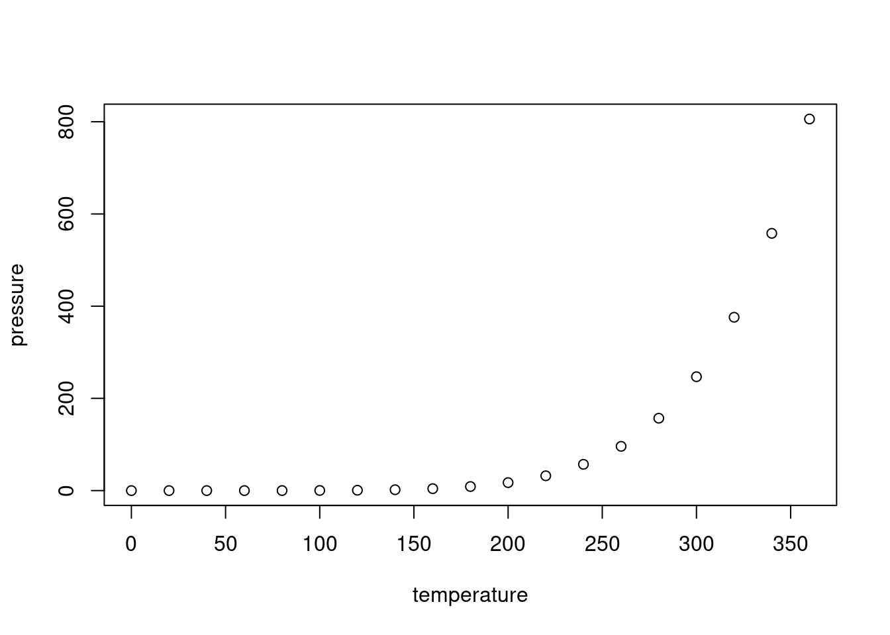

# PACMOS


<!-- badges: start -->

[](https://github.com/lipikakalson/PACMOS/actions/workflows/R-CMD-check.yaml)
[](https://lifecycle.r-lib.org/articles/stages.html)
[](LICENSE)
<!-- badges: end -->

This R package provides a streamlined workflow to integrate query samples into reference MOFA (Multi-Omics Factor Analysis) models, perform inference (fuzzy/hard clustering), and visualize biological patterns.

The package is designed for reproducible, modular analysis of multi-omics datasets, enabling:
<ul>Integration of query samples into existing MOFA inputs.
<ul>MOFA model retraining.
<ul>Projection of query samples into reference latent spaces.
<ul>Fuzzy/Hard clustering.
<ul>Visualization of clustering.
  
## Installation

You can install the development version of PACMOS from
[GitHub](https://github.com/) with:

``` r
# install.packages("devtools")
devtools::install_github("lipikakalson/PACMOS")
```

## Example

This is a basic example which shows you how to solve a common problem:

``` r
library(PACMOS)
## basic example code
```

What is special about using `README.Rmd` instead of just `README.md`?
You can include R chunks like so:

``` r
summary(cars)
#>      speed           dist       
#>  Min.   : 4.0   Min.   :  2.00  
#>  1st Qu.:12.0   1st Qu.: 26.00  
#>  Median :15.0   Median : 36.00  
#>  Mean   :15.4   Mean   : 42.98  
#>  3rd Qu.:19.0   3rd Qu.: 56.00  
#>  Max.   :25.0   Max.   :120.00
```

You’ll still need to render `README.Rmd` regularly, to keep `README.md`
up-to-date. `devtools::build_readme()` is handy for this.

You can also embed plots, for example:



In that case, don’t forget to commit and push the resulting figure
files, so they display on GitHub and CRAN.
