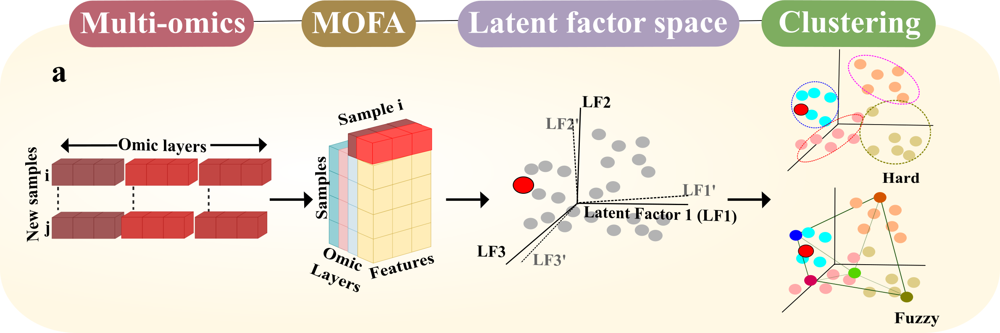

# PACMOS


<!-- badges: start -->

[](https://github.com/lipikakalson/PACMOS/actions/workflows/R-CMD-check.yaml)
[](https://lifecycle.r-lib.org/articles/stages.html)
[](LICENSE)
<!-- badges: end -->

This R package provides a streamlined workflow to integrate query samples into reference MOFA (Multi-Omics Factor Analysis) models, perform inference (fuzzy/hard clustering), and visualize biological patterns.

The package is designed for reproducible multi-omics datasets, enabling:
<ul>
  <li>Integration of query samples into existing MOFA inputs.</li>
  <li>MOFA model retraining.</li>
  <li>Projection of query samples into reference latent spaces. </li>
  <li>Fuzzy/Hard clustering.</li>
  <li>Visualization of clustering.</li>
  </ul>



## Installation

You can install the development version of PACMOS from
[GitHub](https://github.com/) with:

``` r
# install.packages("devtools")
devtools::install_github("IARCbioinfo/PACMOS", dependencies = TRUE)
```

## Tutorial
A tutorial on the usage of PACMOS is available in the docs folder. PACMOS has been validated on two datasets:
  - [Pleural Mesothelioma (MESOMICS)](https://github.com/IARCbioinfo/PACMOS/blob/main/doc/PACMOS-MESOMICS.html)
  - [Lung neuroendocrine tumors (lungNENomics)](https://github.com/IARCbioinfo/PACMOS/blob/main/doc/PACMOS-lungNENomics.html)

## Functions

### Step 1
This function adds one or more query samples to reference MOFA input matrices in an incremental manner. Each query matrix is matched to a specific MOFA data layer, and the corresponding values are inserted into the reference matrices. For all other layers, NA values are added to maintain consistent structure across views.

The updated matrices (reference + one query sample) are saved as `.RData` files
```
s1_add_sample_to_mofa(
  query_matrix_path,
  mofa_dir = system.file("extdata/", package = "PACMOS"),
  value_data_types = NULL,
  outdir = "output/",
  python_bin
)
```
where,
<ol>
  <li>query_matrix_path =  Character vector of CSV file paths containing query sample matrices. First column is expected as gene_id, if not, first column is assumed as gene_id.</li>
  <li>mofa_dir          =  Character. Directory containing reference MOFA '.RData' matrices (e.g. 'D_expr_MOFA.RData', 'D_alt_MOFA.RData'). These objects must have rownames corresponding to gene IDs.</li>
  <li>value_data_types  = Character vector maping each query matrix to its corresponding reference MOFA data layer. Must be the same length as `query_matrix_path`. Each element should exactly match the name of a MOFA input object as it appears when the reference .RData files are loaded into R.</li>
  <li>outdir            = Character. Root directory folder where output will be stored.</li>
  <li>python_bin        = Path to the Python binary used by the MOFA environment via the `reticulate` package.</li>
</ol>

### Step 2
This function trains a MOFA2 model using the matrices generated in `s1_add_sample_to_mofa()`.
```
s2_run_mofa(
  models_dir,
  matrices_subdir = "inputs",
  num_factors = 10,
  convergence_mode = "slow",
  maxiter = 10000,
  use_basilisk = FALSE,
  skip_existing = TRUE,
  python_bin,
  outfile_prefix = "",
  views_map,
  binary_views = NULL
)
```
where,
<ol>
  <li>models_dir      =  Root directory folder. Same as `s1_add_sample_to_mofa() outdir`.</li>
  <li>matrices_subdir =  Folder name where `.RData` files are stored. (`inputs` by default)</li>
  <li>python_bin      =  Path to the Python binary used by the MOFA environment via the `reticulate` package.</li>
  <li>views_map       =  Named character vector mapping MOFA view names to the corresponding matrix object names loaded from `.RData` files. Names define the view labels (e.g. "RNA"), and values specify the matrix objects (e.g. "D_expr_MOFA"). For example: views_map = c(RNA = "D_expr_MOFA", CNV = "D_cnv_MOFA", ALT = "D_alt_MOFA"). The view names are only labels and do not affect the analysis.</li>
  <li>binary_views    =  Character vector specifying which views contain binary data (e.g. mutation or alteration layers).</li>
</ol>

### Step 3
This function projects query samples into the reference latent factor space and generates quality control and projection visualizations.
```
s3_plot_query_samples_mofa(
  models_dir,
  matrices_subdir = "inputs",
  query_sample,
  reference_LFs,
  reference_axes,
  id_col = NULL,
  group = "group1",
  python_bin   = NULL,
  output_dir= NULL,
  prefix = ""
)
```
where,
<ol>
  <li>models_dir      =  Root directory folder. Same as `s1_add_sample_to_mofa() outdir`. </li>
  <li>matrices_subdir =  Folder name where `.hdf5` files are stored (`inputs` by default).</li>
  <li>query_sample    =  Sample ID of the query sample.</li>
  <li>reference_LFs   =  data.frame or path to CSV containing reference latent factors.</li>
  <li>reference_axes  =  Character vector of reference axis column names (Latent factors) we need to match and align.</li>
  <li>id_col          =  Character. Column name in \code{reference_LFs} that contains sample identifiers. These IDs must match the sample names used in the MOFA model. If NULL, the function uses the "Sample" column if present, otherwise the first column.</li>
  <li>group           =  MOFA group name (default \code{"group1"})</li>
  <li>python_bin      =  Path to the Python binary used by the MOFA environment via the `reticulate` package.</li>
  <li>output_dir      =  Output dir where the results are saved (default is `plots`)</li>
  <li>prefix          =  Character prefix for all written files.</li>
</ol>

## FUZZY CLUSTERING
### Step 4
This function estimates the degree to which each query sample belongs to each biological archetype predefined in reference multiomics data using a fuzzy least constraint square approach.
```
archetype_coords <- data.frame(
  Archetype = c("a", "b", "c"), # archetypes
  LF1 = c(
    -3.59733245242571,
    -1.79807036681759,
    3.85856701073313
  ),
  LF2 = c(
    -2.39600999565261,
    3.56348237698459,
    -0.825586204203109
  ), # archetype coordinates in LF space
  stringsAsFactors = FALSE
)

infer_fuzzy_proportion(
  models_dir,
  coord,
  n_archetypes,
  reference_axes = NULL,
  input_type = c("stable", "retrained"),
  out_dir = file.path(models_dir, "archetype_proportion"),
  prefix = ""
)
```
where,
<ol>
  <li>models_dir      =  Root directory folder. Same as `s1_add_sample_to_mofa() outdir`.</li>
  <li>coord           =  Data frame of archetype coordinates</li>
  <li>n_archetypes    =  Expected number of archetypes.</li>
  <li>reference_axes  =  Latent factors column names (from reference) to use for archetype proportion inference. These must match column names in the input matrices and correspond to the same dimensions used to define the archetype coordinates in `coord`. If NULL, all numeric columns are used.</li>
  <li>input_type      = Which aligned matrix to use as input. Either "stable" (reference + query; from `_stable_input.csv`) or "retrained" (all retrained model samples; from `_retrained_LFs_all_samples.csv`).</li>
  <li>out_dir         = Output directory for aggregated CSV. Defaults to `models_dir/archetype_proportion/`.</li>
  <li>prefix          = Character prefix for output files</li>
</ol>

### Step 5
This function visualizes the archetype composition of query samples in the reference archetypal space based on the inferred fuzzy archetype proportion.
```
plot_fuzzy_query_sample(
  models_dir,
  sample_pattern = "",
  prefix = ""
)
```
where,
<ol>
  <li>models_dir      =  Root directory folder. Same as `s1_add_sample_to_mofa() outdir`.</li>
  <li>sample_pattern  =  Regex to filter sample folder names.</li>
  <li>prefix          =  Prefix for output PDF filenames.</li>
</ol>

## HARD CLUSTERING
### Step 4
This function assigns each query sample to a discrete cluster using k-means clustering in the latent factor space.
```
infer_kmeans_clusters(models_dir,
                      k,
                      input_type = c("stable", "retrained"),
                      lf_cols,
                      prefix = ""
)
```
where,
<ol>
  <li>models_dir      =  Root directory folder. Same as `s1_add_sample_to_mofa() outdir`.</li>
  <li>k               =  Number of k-means clusters.</li>
  <li>input_type      = Which aligned matrix to use as input. Either "stable" (reference + query; from `_stable_input.csv`) or "retrained" (all retrained model samples; from `_retrained_LFs_all_samples.csv`).</li>
  <li>lf_cols         =  Character vector specifying which latent factor columns to use as features for k-means clustering. These define the feature space for clustering and must exist in the input matrix.</li>
  <li>prefix          =  Prefix for output PDF filenames.</li>

</ol>

### Step 5
This function visualizes the hard clustering results obtained from infer_kmeans_clusters().
```
plot_kmeans_query_sample(
  models_dir,
  input_type = c("stable", "retrained"),
  lf_cols,
  ref_labels_path,
  ref_cols,
  sample_pattern = "",
  prefix = ""
)
```
where,
<ol>
  <li>models_dir      =  Root directory folder. Same as `s1_add_sample_to_mofa() outdir`.</li>
  <li>input_type      =  Which aligned matrix to use as input. Either "stable" (reference + query; from `_stable_input.csv`) or "retrained" (all retrained model samples; from `_retrained_LFs_all_samples.csv`).</li>
  <li>lf_cols         =  Character vector specifying which latent factor columns to visualize. These columns must exist in the aligned latent factor matrix and define the axes used for pairwise scatter plots. All pairwise combinations of lf_cols are plotted. </li>
  <li>ref_labels_path =  Path to CSV containing reference labels.
  <li>ref_cols        =  Character vector of length 2. Column names in the `ref_labels_path` CSV to use. E.g. c("sample", "bio_label")</li>
  <li>sample_pattern   = Regex to filter sample folder names.</li>
  <li>prefix           = Prefix for output PDF filenames.</li>
</ol>

## Output directory structure
```
<outdir>/
  <query_sample>/
    <inputs>/
      value_data_type_query_sample.RData (Step 1 output)
        MOFA-query_sample.hdf5 (Step 2 output)
    <outputs>/
        #--Step 3 outputs--
        query_sample_projection.pdf
        query_sample_quality_check_metrics.csv
        query_sample_quality_check_metrics.pdf
        query_sample_query_sample_LFs.csv
        query_sample_retrained_LFs_all_samples.csv
        query_sample_stable_input.csv

        # FUZZY
        #--Step 4 output-- 
        query_sample_archetype_proportion_all_samples.csv
        query_sample_archetype_proportion.csv

        #--Step5 output--
        query_sample_archetype_projection.pdf

        # HARD
        #--Step 4 output--
        query_sample_sample_clusters.csv

        #--Step 5 output-- 
        query_sample_kmeans_cluster.pdf
        query_sample_cluster_label_map.csv
        query_sample_kmeans_heatmap.csv
```
